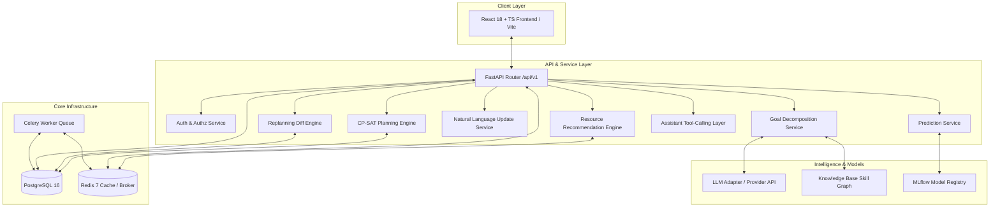
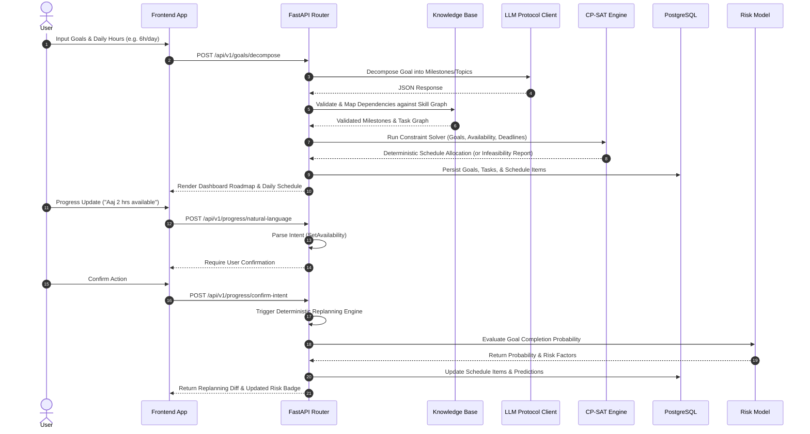
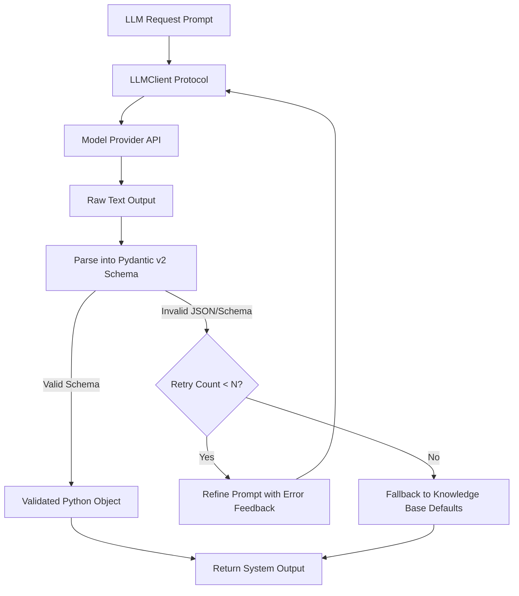

# ARCHITECTURE.md — Planova System Architecture & System Design

Planova is built as a resilient, decoupled micro-monolith designed for high predictability, type safety, deterministic planning, and production observability.

---

## 1. High-Level Component Diagram



---

## 2. End-to-End Data Flow Sequence



---

## 3. Planning & Replanning Engine Architecture

### A. CP-SAT Mathematical Constraint Solver (`backend/app/planning/`)
The planning engine translates active user goals, available hours, task estimates, and prerequisites into a Mixed-Integer Programming (MIP) problem solved via Google OR-Tools CP-SAT.

#### Hard Constraints (Must NEVER be violated):
1. **Capacity Constraint**: Total task duration scheduled on day $d$ cannot exceed user's available time $A_d$.
$$\sum_{t \in T_d} \text{duration}(t) \le A_d$$
2. **Prerequisite Precedence**: Task $B$ depending on Task $A$ must be scheduled strictly after $A$ completes:
$$\text{start\_date}(B) \ge \text{completion\_date}(A)$$
3. **No Splitting Beyond Max Task Length**: Tasks cannot exceed 120 continuous minutes.
4. **Horizon Boundary**: All tasks for goal $G$ must complete on or before $G.\text{deadline}$.

#### Objective Function (Maximize Weighted Score):
$$\text{Maximize } Z = w_1 \cdot \text{Priority} + w_2 \cdot \text{DeadlinePressure} + w_3 \cdot \text{MilestoneMomentum} - w_4 \cdot \text{DailyLoadVariance}$$

#### Infeasibility Diagnostics:
If CP-SAT returns `INFEASIBLE`, the engine does NOT generate a invalid or corrupted schedule. Instead, it computes a structured diagnostic report offering options:
- Option A: Extend target deadline by $N$ days.
- Option B: Increase daily available study budget by $H$ hours.
- Option C: Defer or pause lower-priority goals.

---

### B. Event-Driven Replanning Diff Engine (`replanning_engine.py`)
Triggered when:
- User logs reduced available hours for today.
- Tasks are missed or skipped.
- Goal deadline or priority changes.

The engine calculates incomplete workload, adjusts remaining capacity, and outputs a **Schedule Diff** object detailing:
- `moved_tasks`: Array of `{ task_id, original_date, new_date, reason }`
- `unaffected_tasks`: Tasks remaining unchanged.
- `overload_warnings`: Notifications if overall completion probability drops.

*Crucial Rule*: Replanning NEVER invokes an LLM to compute schedules. It is 100% deterministic and explainable.

---

## 4. LLM Safety & Validation Protocol

To ensure reliability and prevent hallucinated outputs, LLM integrations strictly adhere to the following workflow:



- **Schema Enforcement**: Every LLM interaction is constrained by a Pydantic v2 model.
- **Retry Policy**: Maximum $N=3$ retries with explicit error propagation in system prompt.
- **Deterministic Fallback**: If retries fail, system seamlessly defaults to Knowledge Base seed patterns.

---

## 5. Monitoring, Telemetry, & Observability

### Structured JSON Logs
All backend logs are emitted to standard output in structured JSON format:
```json
{
  "timestamp": "2026-10-07T10:15:30.123Z",
  "level": "INFO",
  "service": "planova-backend",
  "trace_id": "req-9a8b7c-6d5e",
  "user_id": "123e4567-e89b-12d3-a456-426614174000",
  "event": "cpsat_solver_completed",
  "duration_ms": 420,
  "status": "OPTIMAL"
}
```

### Prometheus Metrics
- `planova_http_requests_total`: Counter by endpoint, status code, and method.
- `planova_http_request_duration_seconds`: Histogram of API latencies.
- `planova_cpsat_solve_duration_seconds`: Histogram of constraint solver execution time.
- `planova_prediction_latency_seconds`: Latency of ML prediction service.
- `planova_active_users_count`: Gauge of concurrent active sessions.

### Grafana Dashboards
1. **API & System Performance Dashboard**: Latencies, throughput, HTTP 4xx/5xx rates.
2. **Planning Engine Dashboard**: Solver status counts (Optimal vs Infeasible), average solve times, replanning event frequencies.
3. **ML Risk Model Dashboard**: Prediction requests, failure risk category distribution (Low/Med/High), model version breakdown (`xgboost-v1` vs `heuristic-v1`).
