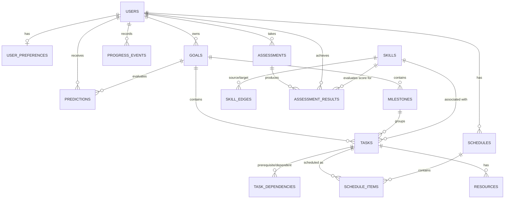

# DATABASE.md — Planova Relational Database Schema & Data Architecture

Planova utilizes a normalized PostgreSQL 16 database managed via SQLAlchemy 2.x and Alembic migrations.

## Entity Relationship (ER) Diagram

---

## Data Principles & Conventions
1. **Primary Keys**: Standardized on `UUID` (`uuid_generate_v4()`) for external entity safety and distributed generation.
2. **Timestamps**: Every table includes `created_at TIMESTAMP WITH TIME ZONE DEFAULT NOW()` and `updated_at TIMESTAMP WITH TIME ZONE DEFAULT NOW()`.
3. **Soft Delete**: Tables representing user domain entities (`goals`, `tasks`, `schedules`) include `deleted_at TIMESTAMP WITH TIME ZONE NULL` for auditability and recovery.
4. **Foreign Keys**: Explicit foreign key constraints with indexed lookup columns (`user_id`, `goal_id`, `milestone_id`, `skill_id`, `deadline`, `status`).
5. **JSONB Usage**: Strictly reserved for unstructured or highly flexible audit/diagnostic payloads (e.g., `predictions.shap_explanation`, `progress_events.raw_nlp_payload`, `schedules.infeasibility_report`). Core entity attributes are strongly typed columns.

---

## Detailed Table Schemas

### 1. `users`
Stores core user account data and consent preferences.
- `id`: UUID (PK)
- `email`: VARCHAR(255) (UNIQUE, NOT NULL)
- `password_hash`: VARCHAR(255) (NOT NULL)
- `full_name`: VARCHAR(255) (NOT NULL)
- `is_active`: BOOLEAN (DEFAULT TRUE)
- `is_superuser`: BOOLEAN (DEFAULT FALSE)
- `data_consent_given`: BOOLEAN (DEFAULT FALSE) — *Consent flag for anonymized ML data usage*
- `consent_updated_at`: TIMESTAMP WITH TIME ZONE (NULL)
- `created_at`: TIMESTAMP WITH TIME ZONE (DEFAULT NOW())
- `updated_at`: TIMESTAMP WITH TIME ZONE (DEFAULT NOW())

### 2. `user_preferences`
Stores daily availability budget and notifications setup.
- `id`: UUID (PK)
- `user_id`: UUID (FK -> users.id, UNIQUE, NOT NULL)
- `default_daily_available_hours`: NUMERIC(4, 2) (DEFAULT 6.0)
- `preferred_study_slots`: JSONB (DEFAULT '["morning", "evening"]')
- `max_consecutive_hours`: NUMERIC(3, 1) (DEFAULT 3.0)
- `rest_days_mask`: INT (DEFAULT 0) — *Bitmask for preferred rest days*
- `timezone`: VARCHAR(64) (DEFAULT 'UTC')
- `created_at`: TIMESTAMP WITH TIME ZONE (DEFAULT NOW())
- `updated_at`: TIMESTAMP WITH TIME ZONE (DEFAULT NOW())

### 3. `goals`
User goals (e.g., "Become ML Engineer", "NIMCET Prep").
- `id`: UUID (PK)
- `user_id`: UUID (FK -> users.id, NOT NULL)
- `title`: VARCHAR(255) (NOT NULL)
- `description`: TEXT (NULL)
- `category`: VARCHAR(64) (NOT NULL) — *e.g., 'career', 'academic', 'exam'*
- `target_deadline`: DATE (NOT NULL)
- `priority`: INT (NOT NULL, DEFAULT 3) — *1 (Lowest) to 5 (Highest)*
- `daily_allocated_hours`: NUMERIC(4, 2) (NOT NULL, DEFAULT 2.0)
- `estimated_total_hours`: NUMERIC(6, 2) (NOT NULL)
- `current_skill_level`: VARCHAR(32) (DEFAULT 'beginner') — *'beginner', 'intermediate', 'advanced'*
- `status`: VARCHAR(32) (DEFAULT 'active') — *'active', 'paused', 'completed', 'abandoned'*
- `created_at`: TIMESTAMP WITH TIME ZONE (DEFAULT NOW())
- `updated_at`: TIMESTAMP WITH TIME ZONE (DEFAULT NOW())
- `deleted_at`: TIMESTAMP WITH TIME ZONE (NULL)
- **Indexes**: `(user_id, status)`, `(target_deadline)`

### 4. `milestones`
High-level phases generated during goal decomposition.
- `id`: UUID (PK)
- `goal_id`: UUID (FK -> goals.id, NOT NULL)
- `title`: VARCHAR(255) (NOT NULL)
- `description`: TEXT (NULL)
- `sequence_order`: INT (NOT NULL)
- `target_completion_date`: DATE (NOT NULL)
- `status`: VARCHAR(32) (DEFAULT 'pending') — *'pending', 'in_progress', 'completed'*
- `created_at`: TIMESTAMP WITH TIME ZONE (DEFAULT NOW())
- `updated_at`: TIMESTAMP WITH TIME ZONE (DEFAULT NOW())
- **Indexes**: `(goal_id, sequence_order)`

### 5. `skills`
Knowledge base skill nodes (e.g., "Linear Algebra", "PyTorch", "C++ Fundamentals").
- `id`: UUID (PK)
- `code`: VARCHAR(64) (UNIQUE, NOT NULL) — *e.g., 'ml_linear_algebra'*
- `name`: VARCHAR(255) (NOT NULL)
- `category`: VARCHAR(64) (NOT NULL) — *e.g., 'ml', 'web_dev', 'nimcet_math'*
- `difficulty_level`: VARCHAR(32) (DEFAULT 'medium')
- `estimated_mastery_hours`: NUMERIC(5, 2) (NOT NULL)
- `description`: TEXT (NULL)
- `created_at`: TIMESTAMP WITH TIME ZONE (DEFAULT NOW())
- **Indexes**: `(code)`, `(category)`

### 6. `skill_edges`
Directed dependencies between skills in the Knowledge Base (Skill Graph).
- `id`: UUID (PK)
- `source_skill_id`: UUID (FK -> skills.id, NOT NULL)
- `target_skill_id`: UUID (FK -> skills.id, NOT NULL)
- `edge_type`: VARCHAR(32) (NOT NULL) — *'prerequisite', 'depends_on', 'related_to', 'recommended_after'*
- `created_at`: TIMESTAMP WITH TIME ZONE (DEFAULT NOW())
- **Constraints**: UNIQUE `(source_skill_id, target_skill_id, edge_type)`
- **Indexes**: `(source_skill_id)`, `(target_skill_id)`

### 7. `tasks`
Granular study/work units decomposed from milestones and skills.
- `id`: UUID (PK)
- `goal_id`: UUID (FK -> goals.id, NOT NULL)
- `milestone_id`: UUID (FK -> milestones.id, NOT NULL)
- `skill_id`: UUID (FK -> skills.id, NULL)
- `title`: VARCHAR(255) (NOT NULL)
- `description`: TEXT (NULL)
- `estimated_duration_minutes`: INT (NOT NULL, DEFAULT 60)
- `actual_duration_minutes`: INT (DEFAULT 0)
- `priority`: INT (DEFAULT 3)
- `status`: VARCHAR(32) (DEFAULT 'pending') — *'pending', 'scheduled', 'completed', 'missed', 'skipped'*
- `completed_at`: TIMESTAMP WITH TIME ZONE (NULL)
- `created_at`: TIMESTAMP WITH TIME ZONE (DEFAULT NOW())
- `updated_at`: TIMESTAMP WITH TIME ZONE (DEFAULT NOW())
- `deleted_at`: TIMESTAMP WITH TIME ZONE (NULL)
- **Indexes**: `(goal_id, status)`, `(milestone_id)`

### 8. `task_dependencies`
Task-level prerequisite relationships.
- `id`: UUID (PK)
- `prerequisite_task_id`: UUID (FK -> tasks.id, NOT NULL)
- `dependent_task_id`: UUID (FK -> tasks.id, NOT NULL)
- `created_at`: TIMESTAMP WITH TIME ZONE (DEFAULT NOW())
- **Constraints**: UNIQUE `(prerequisite_task_id, dependent_task_id)`

### 9. `schedules`
Container for output schedule instances generated by CP-SAT solver.
- `id`: UUID (PK)
- `user_id`: UUID (FK -> users.id, NOT NULL)
- `start_date`: DATE (NOT NULL)
- `end_date`: DATE (NOT NULL)
- `is_active`: BOOLEAN (DEFAULT TRUE)
- `solver_status`: VARCHAR(32) (NOT NULL) — *'OPTIMAL', 'FEASIBLE', 'INFEASIBLE'*
- `infeasibility_report`: JSONB (NULL) — *Diagnostic details if solver failed*
- `created_at`: TIMESTAMP WITH TIME ZONE (DEFAULT NOW())
- **Indexes**: `(user_id, is_active)`

### 10. `schedule_items`
Allocated daily schedule slots.
- `id`: UUID (PK)
- `schedule_id`: UUID (FK -> schedules.id, NOT NULL)
- `task_id`: UUID (FK -> tasks.id, NOT NULL)
- `scheduled_date`: DATE (NOT NULL)
- `start_time`: TIME (NOT NULL)
- `end_time`: TIME (NOT NULL)
- `allocated_duration_minutes`: INT (NOT NULL)
- `is_completed`: BOOLEAN (DEFAULT FALSE)
- `created_at`: TIMESTAMP WITH TIME ZONE (DEFAULT NOW())
- **Indexes**: `(schedule_id, scheduled_date)`, `(task_id)`

### 11. `resources`
Recommended study material (videos, docs, articles).
- `id`: UUID (PK)
- `skill_id`: UUID (FK -> skills.id, NULL)
- `task_id`: UUID (FK -> tasks.id, NULL)
- `title`: VARCHAR(255) (NOT NULL)
- `url`: TEXT (NOT NULL)
- `provider`: VARCHAR(64) (NOT NULL) — *'youtube', 'documentation', 'github', 'course'*
- `duration_minutes`: INT (NOT NULL)
- `quality_score`: NUMERIC(3, 2) (DEFAULT 0.80)
- `relevance_score`: NUMERIC(3, 2) (DEFAULT 0.90)
- `created_at`: TIMESTAMP WITH TIME ZONE (DEFAULT NOW())
- **Indexes**: `(skill_id)`, `(task_id)`

### 12. `progress_events`
Log of user actions, study sessions, and natural language status updates.
- `id`: UUID (PK)
- `user_id`: UUID (FK -> users.id, NOT NULL)
- `event_type`: VARCHAR(64) (NOT NULL) — *'task_completed', 'availability_changed', 'nlp_update', 'milestone_achieved'*
- `logged_hours`: NUMERIC(4, 2) (DEFAULT 0.0)
- `raw_nlp_payload`: TEXT (NULL)
- `parsed_intent`: JSONB (NULL)
- `created_at`: TIMESTAMP WITH TIME ZONE (DEFAULT NOW())
- **Indexes**: `(user_id, event_type, created_at)`

### 13. `assessments` & `assessment_results`
Domain knowledge tests and user performance scores.
- `assessments.id`: UUID (PK)
- `assessments.category`: VARCHAR(64) (NOT NULL)
- `assessments.title`: VARCHAR(255) (NOT NULL)
- `assessments.question_set`: JSONB (NOT NULL)
- `assessment_results.id`: UUID (PK)
- `assessment_results.user_id`: UUID (FK -> users.id, NOT NULL)
- `assessment_results.assessment_id`: UUID (FK -> assessments.id, NOT NULL)
- `assessment_results.skill_id`: UUID (FK -> skills.id, NOT NULL)
- `assessment_results.score`: NUMERIC(5, 2) (NOT NULL)
- `assessment_results.created_at`: TIMESTAMP WITH TIME ZONE (DEFAULT NOW())

### 14. `predictions`
Historical risk prediction snapshots output by the ML model.
- `id`: UUID (PK)
- `user_id`: UUID (FK -> users.id, NOT NULL)
- `goal_id`: UUID (FK -> goals.id, NOT NULL)
- `model_version`: VARCHAR(64) (NOT NULL) — *e.g., 'xgboost-v1.2' or 'heuristic-v1'*
- `completion_probability`: NUMERIC(4, 3) (NOT NULL) — *0.000 to 1.000*
- `risk_category`: VARCHAR(16) (NOT NULL) — *'LOW', 'MEDIUM', 'HIGH'*
- `top_risk_factors`: JSONB (NOT NULL) — *Parsed SHAP or heuristic reason codes*
- `prediction_timestamp`: TIMESTAMP WITH TIME ZONE (DEFAULT NOW())
- **Indexes**: `(user_id, goal_id, prediction_timestamp)`
