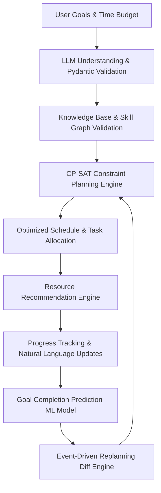

# Planova — Startup-Grade Adaptive Planning SaaS

> **Status:** Phase 0 complete (Scaffolding & Architecture Docs). **Not yet runnable.** Implementation starts in Phase 1.

Planova is an intelligent, adaptive multi-goal planning platform. It transforms ambitious, multi-domain goals (e.g., *"Become an ML Engineer in 6 months, maintain an 8+ CGPA in BCA, and prepare for NIMCET with 6 hours/day available"*) into realistic, mathematically optimized daily schedules, skill roadmaps, resource recommendations, dynamic risk predictions, and automated replanning.

---

## 🌟 Product Vision & Intelligence Pipeline

Planova combines structured knowledge graphs, verified LLM goal decomposition, deterministic mathematical constraint solving (Google OR-Tools CP-SAT), real-time progress tracking, and machine learning risk prediction. It is designed from the ground up to be deterministic, safe, and transparent — NOT a raw LLM wrapper.



---

## 🛠️ Technology Stack

| Layer | Technologies | Justification |
| :--- | :--- | :--- |
| **Frontend** | React 18, TypeScript (strict), Vite, Tailwind CSS, React Router, TanStack Query, Zod | Modern, type-safe, fast build times, robust query state management. |
| **Backend** | Python 3.11+, FastAPI, Pydantic v2, SQLAlchemy 2.x, Alembic | Asynchronous Python stack with high performance and strong typing. |
| **Optimization** | Google OR-Tools (CP-SAT) | Deterministic mathematical constraint solving with guaranteed tie-breaking. |
| **ML & Data** | scikit-learn, XGBoost, LightGBM, SHAP, MLflow, DVC | Production-grade tabular ML, explainability, metric tracking, and dataset versioning. |
| **Databases** | PostgreSQL 16, Redis 7 | Normalized transactional storage + low-latency caching and Celery message brokering. |
| **Async Jobs** | Celery (Redis broker) | Background execution for replanning, data ingestion, and resource scoring. |
| **Ops & Telemetry**| Docker, Docker Compose, GitHub Actions, Prometheus, Grafana | Containerized deployment, automated CI/CD, and full observability. |

---

## 📂 Repository Structure

```
Planova/
├── .github/
│   └── workflows/          # GitHub Actions CI pipeline configs
├── backend/
│   ├── app/                # FastAPI application (routes, services, models, repos, planning)
│   ├── pyproject.toml      # Backend dependency manifest (uv/pip)
│   └── tests/              # Backend pytest suite
├── frontend/
│   ├── src/                # React + TypeScript source code
│   ├── package.json        # Frontend package manifest (pnpm)
│   ├── vite.config.ts      # Vite configuration
│   └── tailwind.config.js  # Tailwind CSS configuration
├── ml/
│   ├── data_generation/    # Synthetic dataset generator
│   ├── notebooks/          # Exploratory & evaluation Jupyter notebooks (01-07)
│   ├── src/                # Modular ML production pipeline (features, train, evaluate, predict)
│   ├── pyproject.toml      # ML environment dependencies
│   └── dvc.yaml            # DVC pipeline specification
├── data/
│   └── knowledge_base/     # Structured skill graphs & dependency seed files (YAML/JSON)
├── docs/                   # Architectural & technical design documentation
│   ├── ARCHITECTURE.md     # System design, data flow, safety & monitoring
│   ├── API.md              # REST API documentation & endpoint specifications
│   ├── DATABASE.md         # Relational database schema, indexes, & ER diagram
│   └── ML_PIPELINE.md      # ML problem formulation, features, evaluation & cold-start
├── docker/                 # Dockerfiles & docker-compose configurations
├── monitoring/             # Prometheus & Grafana configurations
├── scripts/                # Utility & database management scripts
├── tests/                  # End-to-end integration test suite
├── DEVELOPMENT_PLAN.md     # Detailed phase-by-phase implementation plan (Phase 0 to 10)
├── AGENTS.md               # Engineering guidelines & constraints
└── README.md               # Project overview (this document)
```

---

## 🚀 Quickstart & Setup Guide

> ⚠️ **Note:** The application codebase is currently in **Phase 0 (Scaffolding & Architecture Docs)**. Backend endpoints and frontend components are stubbed and marked as non-runnable until Phase 1 and Phase 2.

### Prerequisites (When implementation is active)
- Node.js 20+ & `pnpm`
- Python 3.11+ & `uv`
- Docker & Docker Compose
- PostgreSQL 16 & Redis 7

### Environment Configuration
1. Copy the example environment file:
   ```bash
   cp .env.example .env
   ```
2. Adjust environment variables in `.env` as required.

### Local Development (Phases 1+)
- **Start Backend**: `cd backend && uv run uvicorn app.main:app --reload`
- **Start Frontend**: `cd frontend && pnpm dev`
- **Run Tests**: `cd backend && pytest` / `cd frontend && pnpm test`

---

## 📜 Documentation Links
- [Development Plan](DEVELOPMENT_PLAN.md)
- [Architecture & System Design](docs/ARCHITECTURE.md)
- [Database Schema & ERD](docs/DATABASE.md)
- [API Specifications](docs/API.md)
- [ML Pipeline Architecture](docs/ML_PIPELINE.md)
- [Engineering Guidelines](AGENTS.md)

---

## ⚖️ License
Distributed under the MIT License. See [`LICENSE`](LICENSE) for details.
